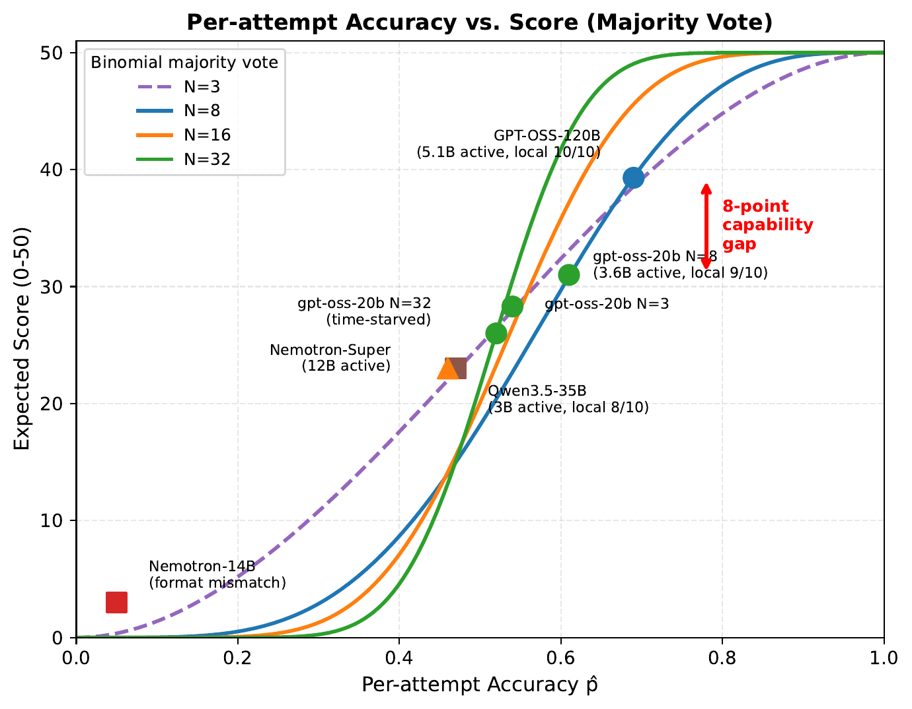

# [Model Capability Dominates: Inference-Time Optimization Lessons from AIMO 3]((https://arxiv.org/abs/2603.27844))

A single model capability metric, per-attempt accuracy *p*, determines majority-vote performance. Diverse reasoning strategies, temperature tuning, and prompt engineering do not help. Across 23+ experiments and 4 model families, none reliably improved on the baseline.

## Summary

gpt-oss-120b (5.1B active parameters, MoE) with N=8 attempts at T=1.0 and entropy-weighted voting scores **39.3/50** on average across **21 runs** (best: 42/50, σ=1.7). At equal N=8, gpt-oss-20b scores **31.0/50** (3-run mean: 35, 28, 30). This **8-point gap** is **4× larger** than any prompt optimization (±2 points). Scaling N=8 to N=32 on gpt-oss-20b backfires. Per-attempt time shrinks, p̂ drops from 0.61 to 0.52, and the score drops to 26. Cross-model validation on Qwen3.5-35B-A3B (23/50, N=16) and Nemotron-Super-120B-NVFP4 (23/50, N=3) confirms that score tracks **capability**, not inference-time strategy.



## Implementation

The `utils/` package provides method-of-moments estimators, voting analysis, and prompt-optimization tooling used in the paper. Each module is self-contained. 

```bash
# Pairwise error correlation across 19 points / 4 models
python -m utils.correlation

# Binomial majority voting and the 8-point capability gap
python -m utils.voting

# Submission-as-lottery-ticket analysis (42 submissions)
python -m utils.lottery

# Verifier-aware selection: re-rank top-K majority candidates
# using constraint / code-execute / lm-reverify strategies
python -m utils.verified_voting

# GEPA-based prompt optimization (Claude API). Seed prompts live in
# utils/system_prompts.py and are selected by experiment id.
python -m utils.optimize_prompt                              # default: BF1
python -m utils.optimize_prompt --experiment EF1             # any id in SYSTEM_PROMPTS
python -m utils.optimize_prompt -e E4 --max-metric-calls 200 # longer search
python -m utils.optimize_prompt -e BF1 --run-dir ./gepa_out  # custom output dir
```

| Quantity | Definition | Source |
|----------|-----------|--------|
| Pairwise correlation $\hat{\rho}$ | $\hat{\rho} = \dfrac{v_c(v_c-1)\,/\,[N(N-1)] - \hat{p}^{2}}{\hat{p}(1-\hat{p})}$ | `correlation.py` |
| Effective sample size $N_{\text{eff}}$ | $N_{\text{eff}} = \dfrac{N}{1 + (N-1)\,\rho}$ | `correlation.py` |
| Expected score | $50 \cdot \Pr\!\left(X \geq \lceil N/2 \rceil\right),\ X \sim \mathrm{Bin}(N, \hat{p})$ | `voting.py` |
| Entropy-weighted score | $w_i = \dfrac{1}{\max(\epsilon_i,\, 10^{-9})},\quad S(a) = \!\!\!\sum_{i:\,a_i = a}\!\!\! w_i$ | `voting.py` |
| Cumulative hit rate | $1 - (1-p)^{K}$ over $K$ submissions | `lottery.py` |
| Verifier-aware vote | $\text{final} = \arg\max_{a}\, S(a) \cdot \bigl(1 + \lambda \cdot \text{verify}(p, a)\bigr)$ | `verified_voting.py` |
| Prompt optimization | GEPA reflective evolutionary search | `optimize_prompt.py` |

### Selection loss and verifier-aware voting

A [host-posted analysis](https://www.kaggle.com/competitions/ai-mathematical-olympiad-progress-prize-3/discussion/679559) ([also on X](https://x.com/AIMOprize/status/2039441022996934783)) reports gpt-oss-120b at $\text{pass@}20 \approx 45.5$ on the private set and $\text{pass@}100 \approx 49/50$. Our best majority-vote run is 42. The six-point gap is **selection loss**: the correct answer already appears in the $N{=}8$ pool, but a more common wrong answer outvotes it. Majority voting is the cheapest possible selector.

`utils/verified_voting.py` re-ranks the top-$K$ most-voted candidates using one of three verifiers, ordered by cost:

| Strategy | Cost / attempt | Catches |
|----------|----------------|---------|
| `constraint_check` | 0 LM, 0 sandbox | Out-of-range, sign, positivity violations (regex over the problem text). |
| `code_execute` | 1 sandbox run | "Correct code, wrong stated answer": re-runs the attempt's last Python block and checks whether its stdout matches the candidate. |
| `lm_reverify` | 1 short LM call | "Majority wrong in the same way": asks the model `YES`/`NO` on substitution and uses the logprob difference. |

```python
from utils.verified_voting import verified_vote, Attempt

attempts = [
    Attempt('37', reasoning='...', entropy=0.8),
    Attempt('37', reasoning='...', entropy=0.9),
    Attempt('42', reasoning='```python\nprint(42)\n```', entropy=0.2),
    # ...
]

answer, debug = verified_vote(
    attempts,
    problem=problem_text,
    strategy='code_execute',   # or 'constraint_check' / 'lm_reverify'
    top_k=3,
    sandbox=jupyter_sandbox,   # required for code_execute
    verifier_weight=2.0,       # 0.0 recovers plain entropy-weighted vote
)
```

Unanimous votes skip verification entirely. Setting `verifier_weight=0.0` recovers the baseline selector, which makes A/B comparison a one-line change. The notebook exposes the same switch as `CFG.verified_voting = True`; the default is `False` so the numbers in the paper are reproducible bit-for-bit.

Selection-level optimization is **not** tested in the paper. It remains open; this module is a starting point, not a result.

---

Fork [the notebook on Kaggle](https://www.kaggle.com/code/natnitarach/aimo-3-model-capability-dominate), set `EXPERIMENT` to any configuration from the ablation table, and run on a single H100.

---

**Paper**: [arXiv:2603.27844](https://arxiv.org/abs/2603.27844)

**Citation**:
```bibtex
@misc{nitarach2026modelcapabilitydominatesinferencetime,
      title={Model Capability Dominates: Inference-Time Optimization Lessons from AIMO 3},
      author={Natapong Nitarach},
      year={2026},
      eprint={2603.27844},
      archivePrefix={arXiv},
      primaryClass={cs.CL},
      url={https://arxiv.org/abs/2603.27844},
}
```
